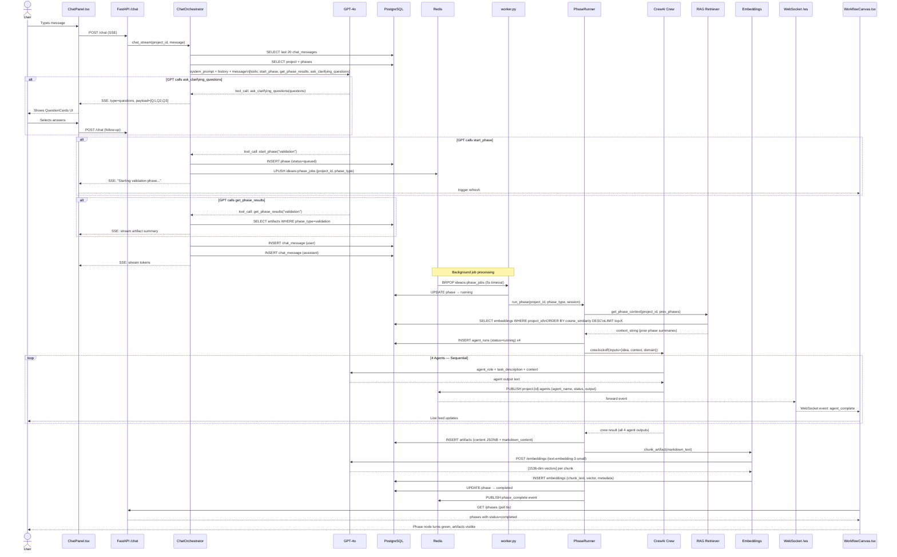
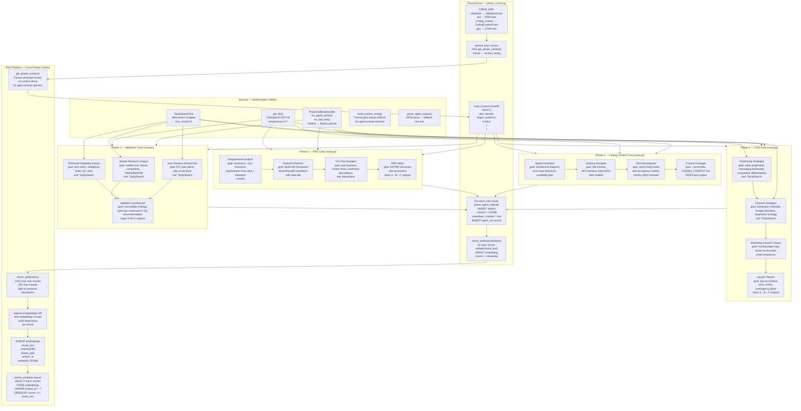
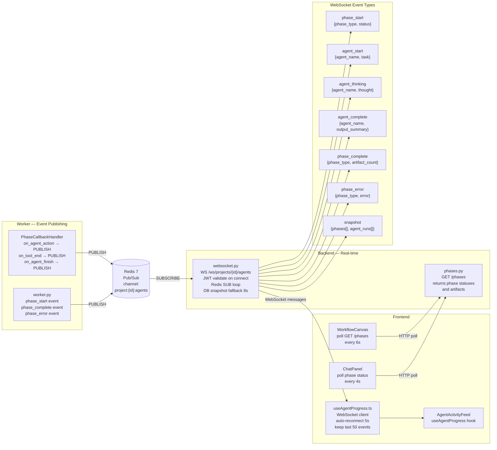
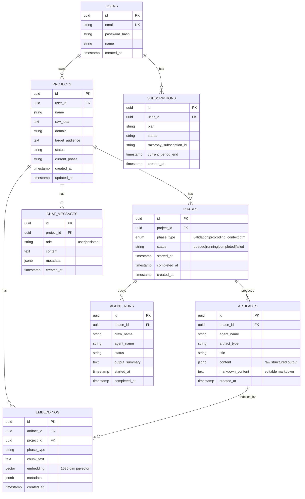
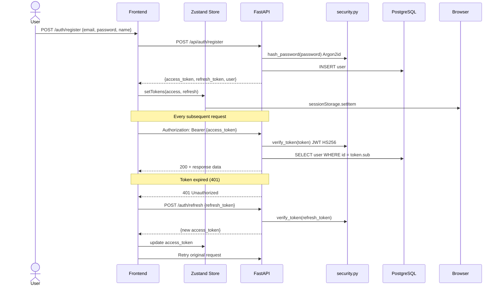
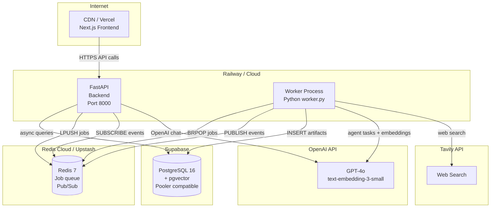

# LaunchPadAI — System Architecture

## Overview

LaunchPadAI is an AI-native SaaS platform that guides indie developers and small startup teams from raw idea validation through PRD generation, coding context export, and go-to-market execution. Every phase is powered by multi-agent AI pipelines with cross-phase context continuity via pgvector retrieval.

---

## 1. High-Level System Architecture

```mermaid
graph TB
    subgraph Browser["Browser — User"]
        U[("👤 User")]
    end

    subgraph Frontend["Frontend — Next.js 14 (App Router)"]
        LP["Landing Page\n/page.tsx"]
        AUTH["Auth Pages\n/auth/login  /auth/signup"]
        DASH["Dashboard\n/dashboard/page.tsx\nProject Grid + Create"]
        PROJ["Project View\n/project/[id]/page.tsx\nSplit: Chat | Canvas"]
        CHAT["ChatPanel.tsx\nSSE streaming\nPolling 4s"]
        CANVAS["WorkflowCanvas.tsx\nReactFlow nodes\nPolling 6s"]
        FEED["AgentActivityFeed.tsx\nLive event log"]
        ZUST["Zustand Store\nauth.ts\nJWT tokens"]
        APICLIENT["api.ts\nREST + SSE client\nAuto token refresh"]
        WSHOOK["useAgentProgress.ts\nWebSocket hook\nAuto-reconnect 5s"]
    end

    subgraph API["Backend — FastAPI (Python 3.12)"]
        CORS["CORS Middleware\nAllowed origins"]
        AUTHR["auth.py\nPOST /register\nPOST /login\nPOST /refresh\nGET /me"]
        PROJR["projects.py\nCRUD /projects"]
        PHASR["phases.py\nPOST /phases/run\nGET /phases\nPATCH /artifacts/{id}"]
        CHATR["chat.py\nPOST /chat (SSE)\nGET /chat/history"]
        WSR["websocket.py\nWS /ws/projects/{id}/agents\nJWT auth on connect"]
        EXPR["export.py\nGET /export/zip\nGET /export/json"]
        SUBR["subscriptions.py\nPlan management"]
        WEBHOOKR["webhooks.py\nRazorpay events"]
        DEPS["deps.py\nget_current_user()\nJWT decode"]
        SECURITY["security.py\nArgon2id hashing\nJWT HS256"]
    end

    subgraph Services["Services Layer"]
        CO["ChatOrchestrator\nchat_orchestrator.py\nGPT-4o function calling\nSSE streaming\nChat history"]
        PHR["PhaseRunner\nphase_runner.py\nCrew orchestration\nArtifact storage\nEmbedding pipeline"]
        RAZ["RazorpayService\nrazorpay_service.py\nPayment processing"]
    end

    subgraph RAG["RAG Pipeline"]
        EMBS["embeddings.py\ntext chunking\n1000 char / 100 overlap\nOpenAI embed call"]
        RET["retriever.py\nstore_embeddings()\nretrieve_context()\nget_phase_context()\ncosine similarity"]
    end

    subgraph Worker["Background Worker — worker.py"]
        WK["Queue Consumer\nBRPOP ideaos:phase_jobs\nThreadPoolExecutor\nFresh DB session/job"]
    end

    subgraph AI["AI / LLM Layer"]
        GPT4O["OpenAI GPT-4o\nChat reasoning\nFunction calling\nAgent task execution"]
        EMB3["text-embedding-3-small\n1536 dimensions\nSemantic vectors"]
        TAVILY["Tavily Search API\nWeb search tool\nMarket research"]
        CREWAI["CrewAI Framework\nSequential process\nShared task context"]
    end

    subgraph Data["Data Layer"]
        PG[("PostgreSQL 16\n+ pgvector\nSupabase hosted\nPool: 20+10")]
        REDIS[("Redis 7\nJob queue\nPub/Sub channel\nproject:{id}:agents")]
    end

    subgraph Agents["Multi-Agent Pipelines"]
        subgraph V["Phase 1 — Validation"]
            V1["Market Research\nAnalyst"]
            V2["Technical Feasibility\nAnalyst"]
            V3["User Persona\nResearcher"]
            V4["Validation\nSynthesizer"]
        end
        subgraph P["Phase 2 — PRD"]
            P1["Requirements\nAnalyst"]
            P2["Feature\nPrioritizer"]
            P3["UX Flow\nDesigner"]
            P4["PRD\nWriter"]
        end
        subgraph C["Phase 3 — Coding Context"]
            C1["System\nArchitect"]
            C2["Schema\nDesigner"]
            C3["Task\nDecomposer"]
            C4["Context\nPackager"]
        end
        subgraph G["Phase 4 — GTM"]
            G1["Positioning\nStrategist"]
            G2["Channel\nStrategist"]
            G3["Marketing Content\nCreator"]
            G4["Launch\nPlanner"]
        end
    end

    %% User → Frontend
    U -->|HTTPS| LP
    U -->|HTTPS| AUTH
    AUTH -->|JWT stored| ZUST
    ZUST -->|token| APICLIENT
    DASH --> APICLIENT
    PROJ --> CHAT & CANVAS & FEED
    CHAT --> APICLIENT
    CANVAS --> APICLIENT
    FEED --> WSHOOK

    %% Frontend → API
    APICLIENT -->|REST / SSE| CORS
    WSHOOK -->|WebSocket| WSR
    CORS --> AUTHR & PROJR & PHASR & CHATR & EXPR & SUBR & WEBHOOKR

    %% Auth flow
    AUTHR --> SECURITY
    AUTHR --> PG
    DEPS --> SECURITY

    %% Chat flow
    CHATR --> CO
    CO -->|function calling| GPT4O
    CO -->|chat history read/write| PG
    CO -->|start_phase tool| PHASR

    %% Phase trigger
    PHASR -->|LPUSH ideaos:phase_jobs| REDIS
    PHASR -->|INSERT phase queued| PG

    %% Worker picks up job
    REDIS -->|BRPOP| WK
    WK -->|UPDATE phase → running| PG
    WK --> PHR

    %% PhaseRunner flow
    PHR -->|get_phase_context| RET
    RET -->|cosine search| PG
    PHR -->|kickoff crew| CREWAI
    CREWAI --> V & P & C & G
    V1 & V2 & V3 --> V4
    P1 --> P2 --> P3 --> P4
    C1 --> C2 --> C3 --> C4
    G1 --> G2 --> G3 --> G4

    %% Agents use tools
    V --> GPT4O & TAVILY
    P --> GPT4O
    C --> GPT4O
    G --> GPT4O & TAVILY

    %% Phase completes
    PHR -->|INSERT artifacts| PG
    PHR -->|chunk text| EMBS
    EMBS -->|embed chunks| EMB3
    EMBS -->|INSERT embeddings| PG
    PHR -->|UPDATE phase → completed| PG

    %% Real-time progress
    PHR -->|PUBLISH project:{id}:agents| REDIS
    REDIS -->|SUB events| WSR
    WSR -->|stream events| WSHOOK

    %% Export + Payments
    EXPR --> PG
    SUBR --> RAZ
    WEBHOOKR --> RAZ
    RAZ --> PG
```

---

## 2. Request Flow — Chat to Phase Execution (Sequence)



---

## 3. Agent Pipeline — Internal Detail



---

## 4. Real-Time Communication Architecture



---

## 5. Database Schema (ERD)



---

## 6. Authentication & Authorization Flow



---

## 7. Infrastructure Stack

| Component | Technology | Config |
|-----------|-----------|--------|
| Frontend | Next.js 14 App Router | Tailwind CSS, Zustand, ReactFlow |
| Backend | FastAPI Python 3.12 | Uvicorn, async SQLAlchemy |
| Database | PostgreSQL 16 + pgvector | Supabase, pool: 20+10, SSL |
| Queue | Redis 7 | BRPOP/LPUSH, Pub/Sub |
| AI Chat | OpenAI GPT-4o | Function calling, SSE streaming |
| AI Agents | CrewAI + GPT-4o | Sequential process, 4 agents/phase |
| Embeddings | text-embedding-3-small | 1536 dims, cosine similarity |
| Web Search | Tavily API | Used by validation + GTM agents |
| Auth | JWT HS256 + Argon2id | sessionStorage, auto-refresh |
| Payments | Razorpay | Subscriptions + webhooks |
| Containers | Docker + Docker Compose | backend, worker, frontend, db, redis |

---

## 8. Deployment Topology



---

## 9. Security Overview

- **Authentication**: JWT access/refresh tokens with Argon2id password hashing
- **Authorization**: Per-request user scoping on all endpoints via `deps.py`
- **Transport**: HTTPS enforced, CORS restricted to allowed origins
- **Secrets**: Environment variables via `.env`, never in source
- **Database**: Parameterized queries via SQLAlchemy ORM
- **Sessions**: Tokens in `sessionStorage` (cleared on tab close)
- **API Keys**: OpenAI/Tavily keys server-side only, never exposed to client
- **Payments**: Razorpay webhook endpoint at `/api/webhooks/razorpay`
