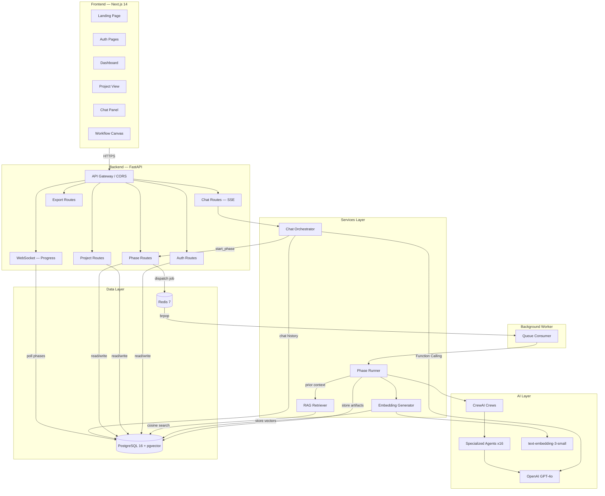
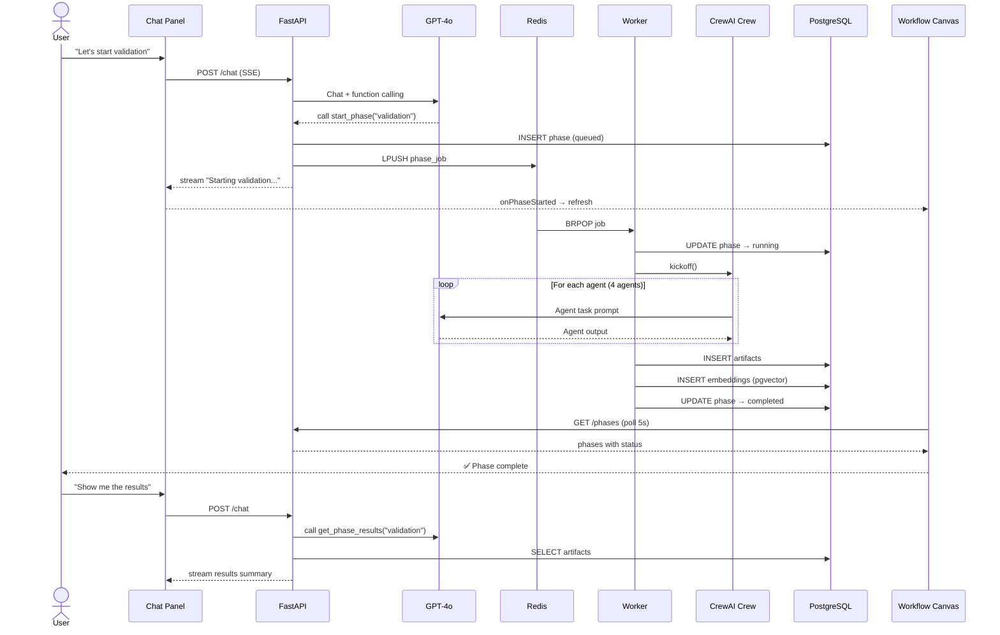
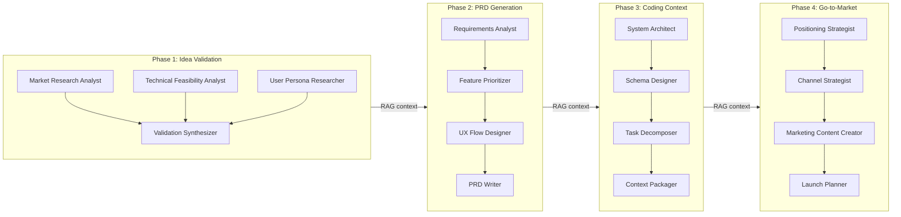
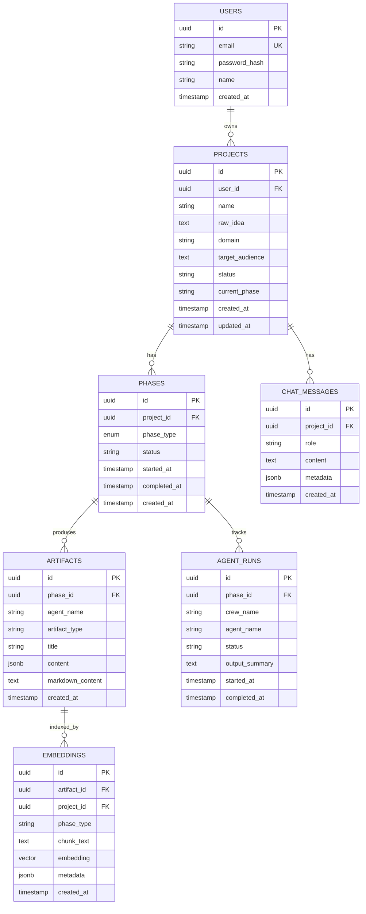

# LaunchPadAI — System Architecture

## Overview

LaunchPadAI is an AI-native SaaS platform that guides indie developers and small startup teams from raw idea validation through PRD generation, coding context export, and go-to-market execution. Every phase is powered by multi-agent AI pipelines with cross-phase context continuity via pgvector retrieval.

---

## High-Level Architecture



---

## Data Flow — Phase Execution



---

## Component Architecture

### Frontend (Next.js 14 App Router)

```
src/
├── app/
│   ├── layout.tsx              Root layout
│   ├── page.tsx                Landing page
│   ├── auth/
│   │   ├── login/page.tsx      JWT login
│   │   └── signup/page.tsx     Registration
│   ├── dashboard/
│   │   ├── layout.tsx          Auth guard + nav
│   │   └── page.tsx            Project grid
│   └── project/
│       └── [id]/page.tsx       Chat + Canvas split view
├── components/
│   ├── chat/
│   │   └── ChatPanel.tsx       Streaming chat with AI co-founder
│   └── canvas/
│       └── WorkflowCanvas.tsx  Phase nodes + artifact viewer
├── hooks/
│   └── useAgentProgress.ts     WebSocket for live progress
└── lib/
    ├── api.ts                  REST + SSE client
    ├── auth.ts                 Zustand auth store
    └── utils.ts                Helpers
```

### Backend (FastAPI + Python 3.12)

```
app/
├── main.py                     FastAPI app + CORS + routers
├── core/
│   ├── config.py               Pydantic Settings (.env)
│   ├── database.py             SQLAlchemy async engine
│   └── security.py             Argon2 + JWT (HS256)
├── models/
│   ├── user.py                 User model
│   ├── project.py              Project model
│   ├── phase.py                Phase model + PhaseType enum
│   ├── artifact.py             Artifact model (JSONB + markdown)
│   ├── agent_run.py            Agent execution tracking
│   ├── embedding.py            pgvector embeddings (1536-dim)
│   └── chat_message.py         Chat history
├── schemas/                    Pydantic request/response schemas
├── api/
│   ├── deps.py                 Auth dependency
│   └── routes/
│       ├── auth.py             Register / login / refresh / me
│       ├── projects.py         CRUD
│       ├── phases.py           Run / list / detail / artifacts
│       ├── chat.py             SSE streaming chat
│       ├── websocket.py        Live agent progress
│       └── export.py           ZIP / JSON export
├── services/
│   ├── phase_runner.py         CrewAI orchestration + artifact storage
│   └── chat_orchestrator.py    GPT-4o with function calling
├── agents/
│   ├── base.py                 Shared LLM config + helpers
│   ├── validation/crew.py      4 agents: market, feasibility, persona, synthesizer
│   ├── prd/crew.py             4 agents: requirements, prioritizer, UX, writer
│   ├── coding_context/crew.py  4 agents: architect, schema, decomposer, packager
│   └── gtm/crew.py             4 agents: positioning, channels, content, launch
├── rag/
│   ├── embeddings.py           Text chunking + OpenAI embeddings
│   └── retriever.py            pgvector cosine similarity search
└── worker.py                   Redis queue consumer
```

---

## AI Agent Architecture



Each phase runs a **CrewAI crew** of 4 specialized agents in sequential process. Agents within a crew share task context. Cross-phase context flows via **pgvector RAG** — after each phase completes, artifacts are chunked, embedded (text-embedding-3-small, 1536 dimensions), and stored. Subsequent phases retrieve the most relevant chunks using cosine similarity.

---

## Database Schema (ERD)



---

## Infrastructure

| Component | Technology | Purpose |
|-----------|-----------|---------|
| Frontend | Next.js 14 (App Router) | SSR + client-side SPA |
| Backend | FastAPI (Python 3.12) | Async REST + SSE + WebSocket |
| Database | PostgreSQL 16 + pgvector | Relational data + vector search |
| Queue | Redis 7 | Background job dispatch |
| AI / LLM | OpenAI GPT-4o | Chat + agent reasoning |
| Embeddings | text-embedding-3-small | 1536-dim semantic vectors |
| Agent Framework | CrewAI | Multi-agent orchestration |
| Auth | JWT (HS256) + Argon2 | Stateless authentication |
| Styling | Tailwind CSS | Utility-first CSS |
| State | Zustand | Client-side auth state |

---

## Security Overview

- **Authentication**: JWT access/refresh tokens with Argon2id password hashing
- **Authorization**: Per-request user scoping on all endpoints
- **Transport**: HTTPS enforced, CORS restricted to allowed origins
- **Secrets**: Environment variables via `.env`, never in source
- **Database**: Parameterized queries via SQLAlchemy ORM
- **Sessions**: Tokens in `sessionStorage` (cleared on tab close)
- **API Keys**: OpenAI key server-side only, never exposed to client
